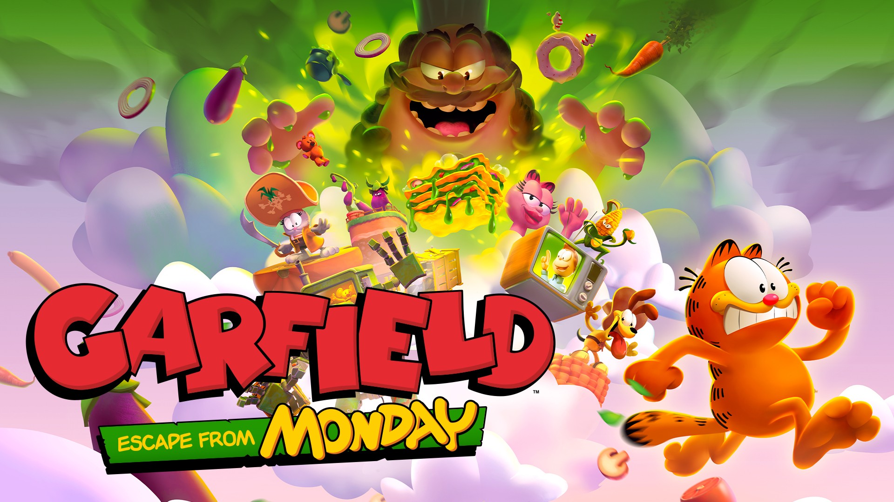

<p align="center">
  
</p>

Garfield may be right not to trust vegetables…

```graphql
# Garfield - Escape From Monday (GLOBAL) (v65536)
./khuong/01000EB0276F2000/89547BD4E42B0FE0/*
  ├─ Inf. Health
  ├─ No Hit Mode
  ├─ Keep Collectibles When Hit
  ├─ Options/*
  │  ├─ Long Invulnerability After Hit
  │  ├─ Move Speed (1.5x)
  │  ├─ Move Speed (2x)
  │  ├─ Move Speed (3x)
  │  ├─ Multi Jump (3)
  │  ├─ Multi Jump (5)
  │  └─ Multi Jump (99)
  ├─ Inf. Dash
  ├─ Inf. Air Attacks
  ├─ Options/*
  │  ├─ Full Flap Power
  │  ├─ Gravity (Low)
  │  └─ Gravity (Moon)
  ├─ High Jump
  ├─ Options/*
  │  ├─ Moon Jump (hold R3)
  │  ├─ Collectibles (999)
  │  └─ Collectibles (9,999)
  ├─ Unlock All Overworld Nodes
  ├─ Unlock Diorama
  └─ Master Key
```

## Changelog
[View here](./CHANGELOG.md)

## Support

Everything here is free and stays free. If you want to leave a tip anyway:
[ko-fi.com/bad1dea](https://ko-fi.com/bad1dea).
