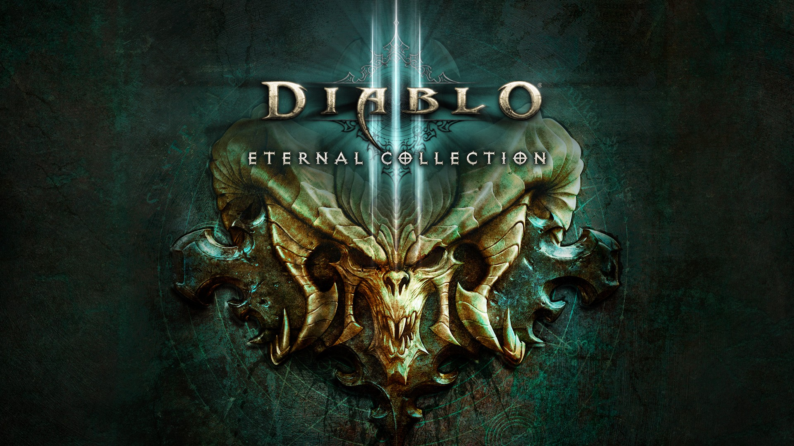

<p align="center">
  
</p>

Raise Some Hell

```graphql
# Diablo III: Eternal Collection (GLOBAL) (v1441792)
./khuong/01001B300B9BE000/2607A74F5DF7754C/*
  ├─ Character/*
  │  ├─ Infinite Health
  │  ├─ Infinite Resource (mana, fury, arcane power, ...)
  │  ├─ No cooldowns (skills and potions)
  │  ├─ One Hit Kill
  │  └─ Damage/*
  │     ├─ Damage x2
  │     ├─ Damage x5
  │     ├─ Damage x10
  │     └─ Damage x100
  ├─ Loot/*
  │  ├─ Legendary and set drop chance/*
  │  │  ├─ Legendary and set drop chance x10
  │  │  ├─ Legendary and set drop chance x100
  │  │  └─ Legendary and set drop chance every drop
  │  ├─ Always Ancient (level 70 legendaries)
  │  ├─ Always Primal (level 70 legendaries)
  │  ├─ Magic Find/*
  │  │  ├─ Magic Find x2 (applies per kill)
  │  │  ├─ Magic Find x5 (applies per kill)
  │  │  ├─ Magic Find x10 (applies per kill)
  │  │  ├─ Magic Find x50 (applies per kill)
  │  │  └─ Magic Find x1000 (applies per kill)
  │  └─ Gold drops/*
  │     ├─ Gold drops x2
  │     ├─ Gold drops x5
  │     ├─ Gold drops x10
  │     ├─ Gold drops x100
  │     └─ Gold drops x1000
  ├─ Kanai's Cube and gems/*
  │  ├─ Any cube recipe opens/*
  │  │  ├─ Any cube recipe opens Not the Cow Level
  │  │  ├─ Any cube recipe opens Treasure Realm
  │  │  └─ Any cube recipe opens Ancient Treasure Realm
  │  ├─ Kanai's Cube keeps ingredients
  │  ├─ Legendary gem upgrade always succeeds
  │  └─ Legendary gem upgrade instant
  ├─ Convenience/*
  │  ├─ Instant town portal
  │  ├─ Auto pickup
  │  └─ All difficulties unlocked
  └─ Events (start a new game after ticking)/*
     ├─ XP bonus/*
     │  ├─ XP bonus x2
     │  ├─ XP bonus x5
     │  ├─ XP bonus x10
     │  ├─ XP bonus x100
     │  └─ XP bonus x1000
     ├─ Gold Find bonus/*
     │  ├─ Gold Find bonus x2
     │  ├─ Gold Find bonus x5
     │  ├─ Gold Find bonus x10
     │  ├─ Gold Find bonus x100
     │  └─ Gold Find bonus x1000
     ├─ Legendary Find bonus/*
     │  ├─ Legendary Find bonus x2
     │  ├─ Legendary Find bonus x5
     │  ├─ Legendary Find bonus x10
     │  ├─ Legendary Find bonus x50
     │  ├─ Legendary Find bonus x100
     │  └─ Legendary Find bonus x1000
     ├─ All seasonal events
     ├─ Double Rift Keystones
     ├─ Double Blood Shards
     ├─ Double Treasure Goblins
     ├─ Double Bounty Bags
     ├─ Royal Grandeur
     ├─ Legacy of Nightmares
     ├─ Triune's Will
     ├─ Pandemonium
     ├─ Forbidden Archives (all Kanai powers)
     ├─ Trials of Tempests
     ├─ Shadow Clones
     ├─ Fourth Kanai's Cube slot
     ├─ Ethereal Memories
     ├─ Fractured Evil (Soul Shards)
     ├─ Echoing Nightmare (Swarm Rifts)
     ├─ Light's Calling (Sanctified Items)
     ├─ Rites of Sanctuary (Dark Alchemy)
     ├─ Visions of Enmity (Nesting Portals)
     ├─ Paragon cap event
     ├─ Anniversary buff
     └─ Cow Level buff (Easter egg world)
```

Thanks to god-jester's [d3hack](https://github.com/god-jester/d3hack), which helped a lot.

## Changelog
[View here](./CHANGELOG.md)

## Support

Everything here is free and stays free. If you want to leave a tip anyway:
[ko-fi.com/bad1dea](https://ko-fi.com/bad1dea).
