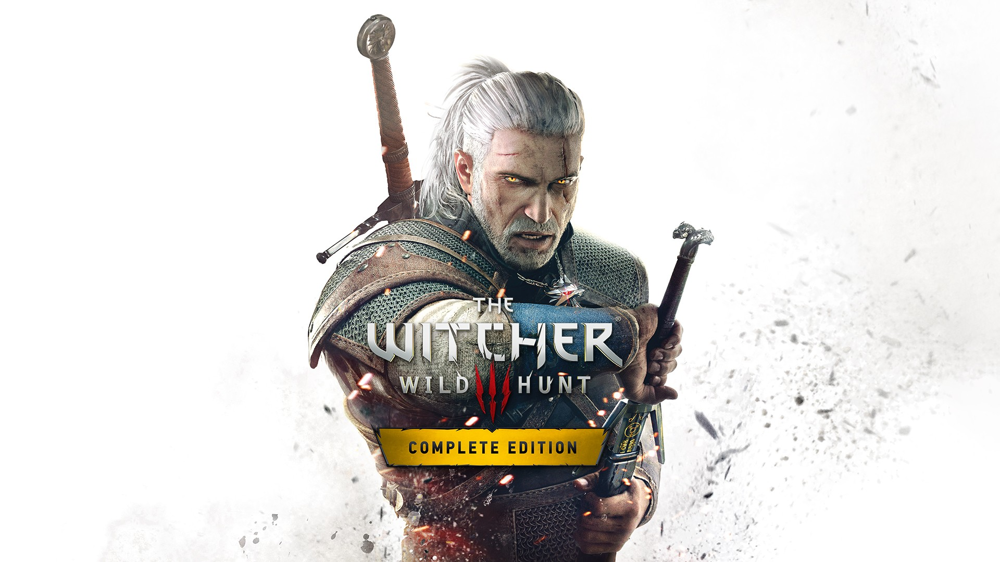

<p align="center">
  
</p>

You are Geralt of Rivia, mercenary monster slayer.

Both files have to be installed: the cheat file in atmosphere/contents/01003D100E9C6000/cheats and the patch in atmosphere/exefs_patches/nxcheats. Copy the whole atmosphere folder to your SD card.

C0AD3CC6D7866578.txt.noips is the full cheat file without the patch, with all the code in it, for anyone who wants to port or edit the cheats. Atmosphere does not load it.

```graphql
# The Witcher 3: Wild Hunt - Complete Edition (GLOBAL) (v4.04d)
./khuong/01003D100E9C6000/C0AD3CC6D7866578/*
  ├─ Infinite Health
  ├─ Infinite Stamina
  ├─ Infinite Adrenaline
  ├─ Infinite Oxygen
  ├─ Zero Toxicity
  ├─ One-Punch Man (OHK)
  ├─ Damage/*
  │  ├─ Damage x2
  │  ├─ Damage x5
  │  └─ Damage x10
  ├─ Add 1000 XP (R+ZR)
  ├─ Ability Points 99
  ├─ Items and Money Don't Decrease
  ├─ Item and Money Gain/*
  │  ├─ Item and Money Gain x2
  │  ├─ Item and Money Gain x5
  │  └─ Item and Money Gain x10
  ├─ Crafting and Alchemy Without Materials
  ├─ Infinite Durability
  ├─ Infinite Potions and Bombs
  ├─ Zero Weight
  ├─ Infinite Horse Stamina
  ├─ No Horse Fear
  ├─ Save Position (R+Left)
  ├─ Restore Position (R+Right)
  ├─ Teleport to Map Pin (R+Up)
  ├─ Game Speed/*
  │  ├─ Game Speed x0.5
  │  ├─ Game Speed x1.5
  │  ├─ Game Speed x2
  │  └─ Game Speed x3
  ├─ Change Weather (R+ZL)
  ├─ Clear Weather (R+ZL+Up)
  ├─ Freeze Time of Day
  ├─ Time Speed/*
  │  ├─ Time Speed x5
  │  └─ Time Speed x20
  ├─ Fixed Camera On (R+L3)
  └─ Fixed Camera Off (R+R3)
```

## Changelog
[View here](./CHANGELOG.md)

## Support

Everything here is free and stays free. If you want to leave a tip anyway:
[ko-fi.com/bad1dea](https://ko-fi.com/bad1dea).
