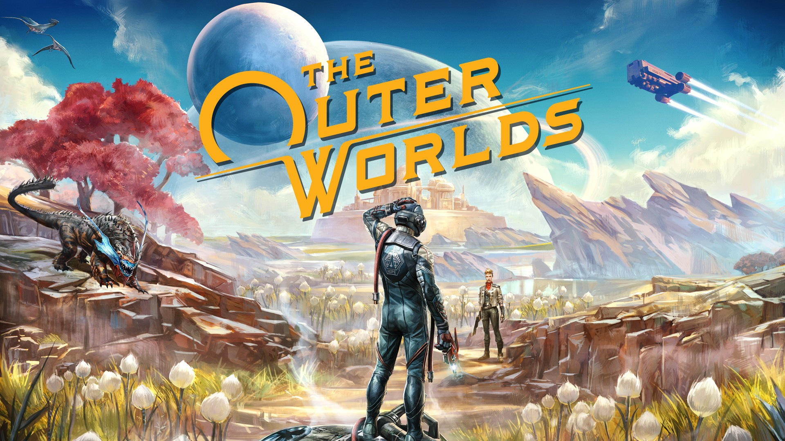

<p align="center">
  
</p>

The Outer Worlds is a new single-player sci-fi RPG from Obsidian Entertainment and Private Division.

```graphql
# The Outer Worlds (GLOBAL) (v1.0.5)
./khuong/0100626011656000/761CD556AB357C87/*
  ├─ Infinite Health
  ├─ Companions Infinite Health
  ├─ Infinite Tactical Time Dilation
  ├─ Items Don't Decrease
  ├─ No Reload
  ├─ Infinite Equipment Durability
  ├─ Ignore Encumbrance
  ├─ Move Speed/*
  │  ├─ Move Speed x1.5
  │  ├─ Move Speed x2
  │  └─ Move Speed x3
  ├─ Jump Height/*
  │  ├─ Jump Height x1.5
  │  ├─ Jump Height x2
  │  └─ Jump Height x3
  ├─ One Hit Kill
  ├─ Damage/*
  │  ├─ Damage x2
  │  ├─ Damage x5
  │  └─ Damage x10
  ├─ Stealth Mode
  ├─ Exp/*
  │  ├─ Exp x2
  │  ├─ Exp x5
  │  └─ Exp x10
  ├─ Bits Gain/*
  │  ├─ Bits Gain x2
  │  ├─ Bits Gain x5
  │  └─ Bits Gain x10
  ├─ Skill Points 99
  ├─ Perk Points 9
  ├─ Unlock All Locked Containers
  ├─ Supernova No Hunger
  ├─ Supernova No Thirst
  ├─ Supernova No Sleep Deprivation
  └─ Supernova Save Anywhere
```

## Changelog
[View here](./CHANGELOG.md)

## Support

Everything here is free and stays free. If you want to leave a tip anyway:
[ko-fi.com/bad1dea](https://ko-fi.com/bad1dea).
