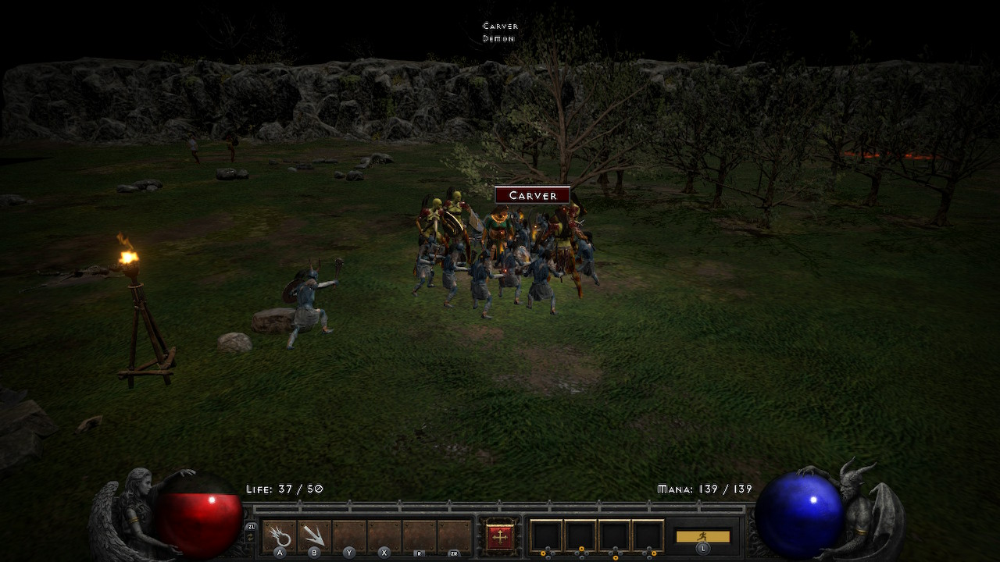

<p align="center">
  
</p>

Relive the epic adventure that defined the action RPG genre for decades

The Master Code enables offline play. Restart the game after installing this set. Forced set drops can fall back to another quality when no set item qualifies.

### 3D perspective



```graphql
# Diablo® II: Resurrected™ (GLOBAL) (v2228224)
./khuong/0100726014352000/DB0507F36B84200A/*
  ├─ Infinite Life
  ├─ Infinite Mana
  ├─ Infinite Stamina
  ├─ No equipment durability loss
  ├─ Stat points not used up
  ├─ Skill points not used up
  ├─ Stat hotkeys (ZL + D-pad; hold ZR for points)
  ├─ Equip without stat, level or class requirements
  ├─ Attack Rating/*
  │  ├─ Attack Rating 1000
  │  ├─ Attack Rating 5000
  │  └─ Attack Rating 10000
  ├─ Max Life/*
  │  ├─ Max Life 500
  │  ├─ Max Life 2000
  │  └─ Max Life 9999
  ├─ Max Mana/*
  │  ├─ Max Mana 500
  │  ├─ Max Mana 2000
  │  └─ Max Mana 9999
  ├─ Max Stamina/*
  │  ├─ Max Stamina 500
  │  ├─ Max Stamina 2000
  │  └─ Max Stamina 9999
  ├─ Defense/*
  │  ├─ Defense 1000
  │  ├─ Defense 5000
  │  └─ Defense 20000
  ├─ Fire Resistance/*
  │  ├─ Fire Resistance 75%
  │  └─ Fire Resistance 95%
  ├─ Cold Resistance/*
  │  ├─ Cold Resistance 75%
  │  └─ Cold Resistance 95%
  ├─ Lightning Resistance/*
  │  ├─ Lightning Resistance 75%
  │  └─ Lightning Resistance 95%
  ├─ Poison Resistance/*
  │  ├─ Poison Resistance 75%
  │  └─ Poison Resistance 95%
  ├─ All Resistances 95%
  ├─ Faster Cast Rate 200%
  ├─ Faster Hit Recovery 200%
  ├─ Faster Block Rate 200%
  ├─ Increased Attack Speed 200%
  ├─ Faster Run/Walk 100%
  ├─ Crushing Blow 100%
  ├─ Deadly Strike 100%
  ├─ Open Wounds 100%
  ├─ Life Steal 20%
  ├─ Mana Steal 20%
  ├─ Damage Reduced 50%
  ├─ XP/*
  │  ├─ XP x2
  │  ├─ XP x5
  │  └─ XP x10
  ├─ Gold drops/*
  │  ├─ Gold drops x2
  │  ├─ Gold drops x5
  │  └─ Gold drops x10
  ├─ Magic Find/*
  │  ├─ Magic Find 200%
  │  ├─ Magic Find 500%
  │  ├─ Magic Find 1000%
  │  ├─ Magic Find 10000%
  │  └─ Magic Find 100000%
  ├─ Gold Find/*
  │  ├─ Gold Find 200%
  │  ├─ Gold Find 500%
  │  └─ Gold Find 1000%
  ├─ Force unique drops (when available)
  ├─ Force set drops (when available)
  ├─ MF: no diminishing returns
  ├─ MF: no minimum chance floor
  ├─ Better drops/*
  │  ├─ Better drops: magic or better
  │  ├─ Better drops: rare or better
  │  └─ Better drops: mostly unique
  ├─ Reset stat overrides (untick presets first)
  ├─ Reveal current level (ZL + R3 to redo)
  ├─ Reveal nearby rooms
  ├─ Unlock all waypoints (not saved)
  ├─ Unlock all acts (not saved)
  ├─ Complete all quests (saved, no rewards)
  ├─ Reset Act/*
  │  ├─ Reset Act 1 quests (tick, wait, untick)
  │  ├─ Reset Act 2 quests (tick, wait, untick)
  │  ├─ Reset Act 3 quests (tick, wait, untick)
  │  ├─ Reset Act 4 quests (tick, wait, untick)
  │  └─ Reset Act 5 quests (tick, wait, untick)
  ├─ Camera zoom/*
  │  ├─ Camera zoom: closer (x0.7)
  │  ├─ Camera zoom: farther (x1.5)
  │  ├─ Camera zoom: far (x2)
  │  └─ Camera zoom: very far (x3)
  ├─ 3D perspective/*
  │  ├─ 3D perspective: 60 deg
  │  ├─ 3D perspective: 45 deg, less stretch
  │  └─ 3D perspective: 60 deg, farther
  ├─ Camera: right stick rotates, R3 resets
  └─ Camera view/*
     ├─ Camera view: default
     ├─ Camera view: rotated 90
     ├─ Camera view: rotated 180
     ├─ Camera view: rotated 270
     ├─ Camera view: flatter (15 deg)
     ├─ Camera view: steeper (45 deg)
     ├─ Camera view: steeper (60 deg)
     └─ Camera view: top-down (85 deg)
```

## Changelog
[View here](./CHANGELOG.md)

## Support

Everything here is free and stays free. If you want to leave a tip anyway:
[ko-fi.com/bad1dea](https://ko-fi.com/bad1dea).
