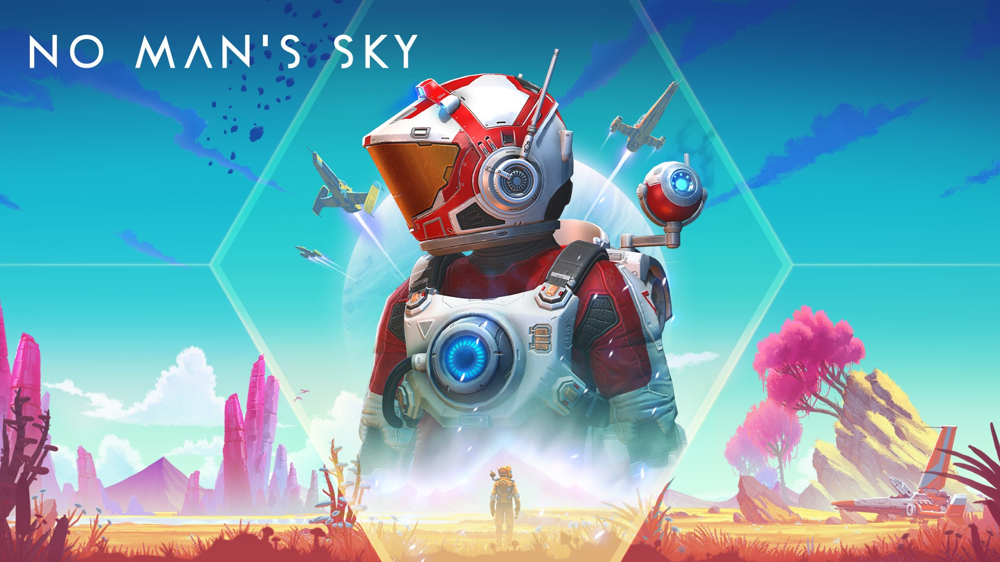

<p align="center">
  
</p>

No Man's Sky is a game about exploration and survival in an infinite procedurally generated universe.

```graphql
# No Man's Sky (GLOBAL) (v5177344)
./khuong/0100853015E86000/97C71E2471E850BD/*
  ├─ Inf. Shields
  ├─ Inf. Health
  ├─ Inf. Stamina
  ├─ Inf. Jetpack
  ├─ Inf. Life Support
  ├─ Inf. Hazard Protection
  ├─ Multi-tool Inf. Energy
  ├─ Multi-tool No Overheat
  ├─ No Reload
  ├─ Infinite Grenades
  ├─ Instant Scanner Recharge
  ├─ Super Damage
  ├─ Faster Walk/Sprint Speed
  ├─ Faster Jetpack Movement Speed
  ├─ Inf. Ship Shields
  ├─ Inf. Ship Life
  ├─ No Ship Weapon Overheat
  ├─ Launch Thruster Infinite Energy
  ├─ Hyperdrive Infinite Energy
  ├─ Crafting Does Not Consume Items
  ├─ Items Not Consumed When Replacing
  ├─ No Crafting Requirements
  ├─ Inf. Items (Max All Stacks + Recharge All Equipment)
  ├─ Open Locks Without Atlas Key
  ├─ Translate All Alien Languages
  ├─ Units 999,292,928
  ├─ Nanites 999,292,928
  ├─ Quicksilver 999,292,928
  ├─ Currencies Never Decrease
  ├─ Money Multiplier/*
  │  ├─ Money Multiplier (2x)
  │  ├─ Money Multiplier (4x)
  │  └─ Money Multiplier (8x)
  ├─ Item Multiplier/*
  │  ├─ Item Multiplier (2x)
  │  ├─ Item Multiplier (4x)
  │  └─ Item Multiplier (8x)
  └─ Corvette Part Limit 999
```

## Changelog
[View here](./CHANGELOG.md)

## Support

Everything here is free and stays free. If you want to leave a tip anyway:
[ko-fi.com/bad1dea](https://ko-fi.com/bad1dea).
