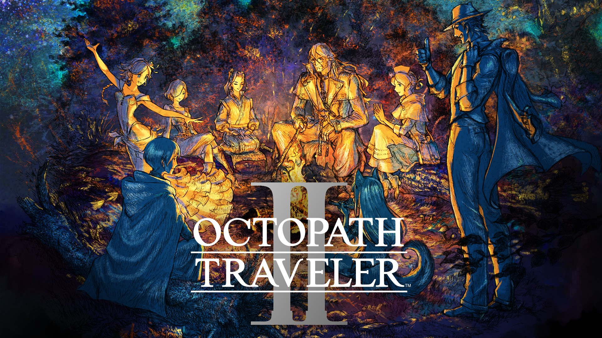

<p align="center">
  
</p>

Embark on an adventure all your own.

```graphql
# OCTOPATH TRAVELER II (GLOBAL) (v131072)
./khuong/0100A3501946E000/0D9649011312F62E/*
  ├─ Infinite HP
  ├─ Infinite SP
  ├─ Max BP
  ├─ Max Latent Power
  ├─ Party Max Stats
  ├─ No Damage Taken
  ├─ Party Cannot Be KOd
  ├─ One Hit Kill
  ├─ Easy Break
  ├─ Always Hit
  ├─ Always Critical
  ├─ Always Escape
  ├─ Always Tame
  ├─ No Random Encounters
  ├─ Battle EXP/*
  │  ├─ Battle EXP x2
  │  ├─ Battle EXP x5
  │  ├─ Battle EXP x10
  │  └─ Battle EXP x100
  ├─ Battle JP/*
  │  ├─ Battle JP x2
  │  ├─ Battle JP x5
  │  ├─ Battle JP x10
  │  └─ Battle JP x100
  ├─ Battle Money/*
  │  ├─ Battle Money x2
  │  ├─ Battle Money x5
  │  ├─ Battle Money x10
  │  └─ Battle Money x100
  ├─ Max Money
  ├─ Max EXP (levels up after a battle)
  ├─ Max JP
  ├─ Held Items x99
  ├─ Game Speed/*
  │  ├─ Game Speed x0.5
  │  ├─ Game Speed x2
  │  ├─ Game Speed x3
  │  └─ Game Speed x4
  └─ Field Commands Always Succeed
```

## Changelog
[View here](./CHANGELOG.md)

## Support

Everything here is free and stays free. If you want to leave a tip anyway:
[ko-fi.com/bad1dea](https://ko-fi.com/bad1dea).
