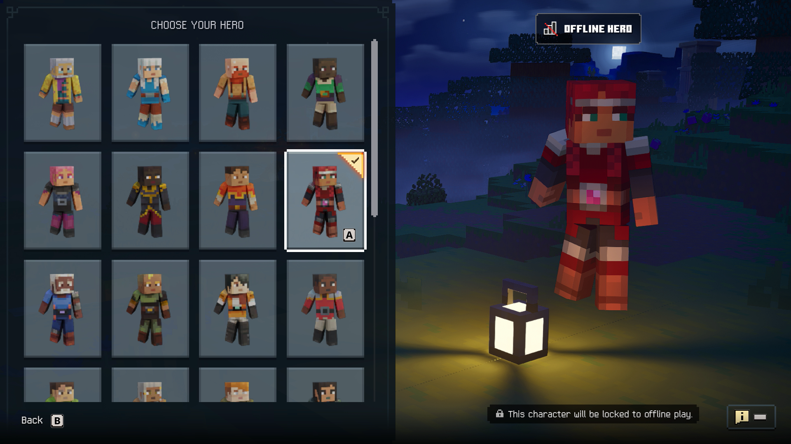
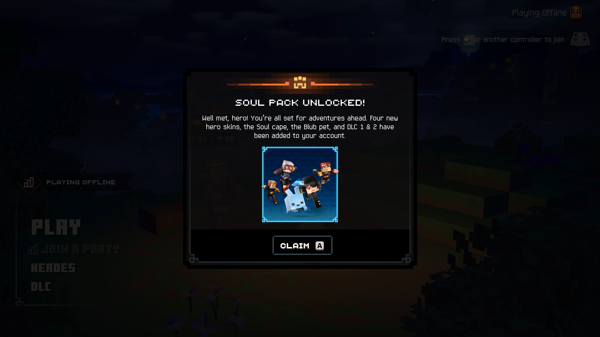
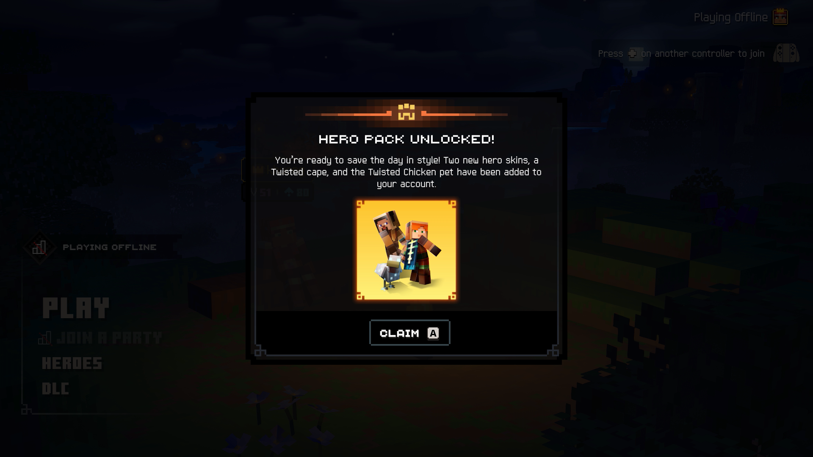
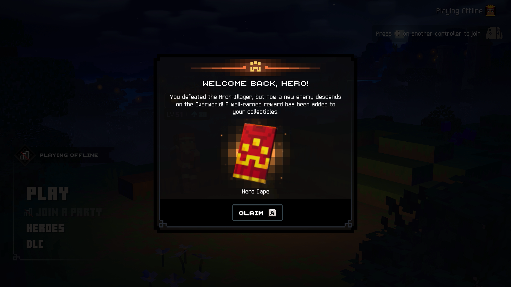

<p align="center">
  
</p>

Minecraft Dungeons II is here with more action, more loot, and more adventure. Step through the rift and fight where no hero has been before: the Sift, an uncharted dimension teeming with threats, mysteries, and breathtaking beauty.

<p>   </p>

The Master Code enables offline play. Restart the game after installing this set.

The console cheats (equip gear, levels, revive and so on) run one at a time: tick one, then untick it before ticking the next.

```graphql
# Minecraft Dungeons II (GLOBAL) (v65536)
./khuong/0100A7C01B792000/9E9D887D59F7F7DB/*
  ├─ Survival/*
  │  ├─ God Mode
  │  ├─ Immortal
  │  ├─ Infinite Potions
  │  ├─ No Potion Cooldown
  │  ├─ Life Steal
  │  ├─ Resistances 0%
  │  ├─ Resistances 100%
  │  ├─ Negate Melee Attacks
  │  ├─ Deflect All Projectiles
  │  ├─ Unstoppable
  │  ├─ Guarding Strike Always
  │  └─ Thorns
  ├─ Combat/*
  │  ├─ Damage x10
  │  ├─ One-Punch Man (OHK)
  │  ├─ Always Critical Hit
  │  ├─ Critical Damage x10
  │  ├─ Attack Speed x2
  │  ├─ Melee Range x2
  │  ├─ Infinite Arrows
  │  ├─ Bow Speed x2
  │  ├─ Fast Arrow Recharge
  │  ├─ Triple Shot
  │  └─ Infinite Throwables
  ├─ Movement/*
  │  ├─ Infinite Roll
  │  ├─ Move Speed x2
  │  └─ Super Jump
  ├─ Artifacts and Companions/*
  │  ├─ No Artifact Cooldown
  │  └─ Companion No Cooldown
  ├─ Resources and Progression/*
  │  ├─ Infinite Emeralds
  │  ├─ Infinite Echo Shards
  │  ├─ Infinite Enchantment Points
  │  ├─ Infinite Souls
  │  ├─ Soul Gathering x5
  │  └─ XP x5
  ├─ Loot and Shops/*
  │  ├─ Free Merchant Refresh
  │  ├─ Max Drop Chance
  │  ├─ Better Item Quality
  │  └─ Double Drops
  ├─ Cosmetics/*
  │  ├─ Unlock Skins, Capes and Pets
  │  ├─ Add All Capes (Once)
  │  ├─ Add All Pets (Once)
  │  ├─ Select Alex Preorder Skin
  │  └─ Select Tank Deluxe Skin
  ├─ Player 1: Health and Combat Commands/*
  │  ├─ Revive
  │  ├─ Toggle Immortality
  │  ├─ Max Health 500
  │  ├─ Max Health 100
  │  ├─ Melee Damage x3
  │  ├─ Melee Damage x1
  │  ├─ Ranged Damage x3
  │  ├─ Ranged Damage x1
  │  ├─ Critical Damage x5
  │  ├─ Critical Damage x1.5
  │  ├─ Melee Attack Speed 2x
  │  ├─ Melee Attack Speed 1x
  │  ├─ Bow Speed 2x
  │  ├─ Bow Speed 1x
  │  ├─ Max Arrows 30
  │  ├─ Max Arrows 15
  │  ├─ Thorns 100%
  │  └─ Deflect 50% Of Projectiles
  ├─ Player 1: Movement and Cooldown Commands/*
  │  ├─ Move Speed 2x
  │  ├─ Move Speed 1x
  │  ├─ Low Gravity 0.5
  │  ├─ Gravity 1
  │  ├─ Jump Height 1.5x
  │  ├─ Jump Height 1x
  │  ├─ Roll Cooldown 0.5 s
  │  ├─ Roll Cooldown 2.5 s
  │  ├─ Potion Cooldown 2 s
  │  └─ Potion Cooldown 20 s
  ├─ Player 1: Progression and Currency Commands/*
  │  ├─ Give 100000 XP
  │  ├─ Level to 50
  │  ├─ Level to 100
  │  ├─ Level for the Current Area
  │  ├─ XP Gain x2
  │  ├─ Emeralds 9999
  │  ├─ Echo Shards 100
  │  ├─ Enchantment Points 99
  │  └─ Souls 100
  ├─ Player 1: Gear and Loot Commands/*
  │  ├─ Gear for the Current Area
  │  ├─ Equip Unique Sword (Level 100)
  │  ├─ Equip Unique Bow (Level 100)
  │  ├─ Equip Unique Helmet (Level 100)
  │  ├─ Equip Unique Leggings (Level 100)
  │  ├─ Equip Unique Boots (Level 100)
  │  ├─ Equip Flame Scepter (Level 100)
  │  ├─ Equip Lightning Rod (Level 100)
  │  ├─ Equip Blizzard Staff (Level 100)
  │  ├─ Looting x3
  │  ├─ Rarity Bonus 50%
  │  ├─ Drop Chance +50%
  │  └─ Drop Duplication 50%
  ├─ World Commands/*
  │  ├─ Unlock All Minecart Stations
  │  ├─ Kill Nearby Hostile Mobs (L3 + R3)
  │  ├─ Nearby Mobs to 1 Health (R3 + Minus)
  │  ├─ Time Dilation 0.5
  │  └─ Time Dilation 1
  └─ Debug/*
     └─ Debug Menu (Settings Screen)
```

## Changelog
[View here](./CHANGELOG.md)

## Support

Everything here is free and stays free. If you want to leave a tip anyway:
[ko-fi.com/bad1dea](https://ko-fi.com/bad1dea).
