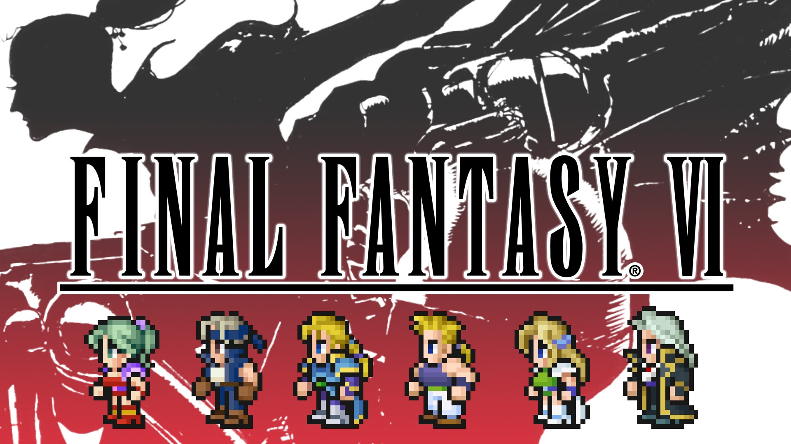

<p align="center">
  
</p>

The original FINAL FANTASY VI comes to life with completely new graphics and audio as a 2D pixel remaster!

**The IPS patch is required.** This set is way past what the Atmosphere cheat VM can hold, so the code lives in the patch and the cheat file only switches it on. Without the patch installed the cheats do nothing.

**What is new here**
FF6 gets Learn All Rages (on a Leap), Esper level-up stat bonus and spell mastery, Terra's Trance Never Ends, Desperation Attacks Always Fire, and Setzer's Slots Always Match. Shadow Never Leaves the Party and the Cursed Shield cheat change story events, so use them with care. Add General Leo to the Party puts him in your roster (a free slot, otherwise the reserve), best in the World of Ruin: if he already left at Thamasa he comes back with no gear. Game Speed goes up to 4x, including cutscenes.

Both files have to be installed: the cheat file in atmosphere/contents/0100AA001415E000/cheats and the patch in atmosphere/exefs_patches/nxcheats. Copy the whole atmosphere folder to your SD card.

E77331AA7883B588.txt.noips is the full cheat file without the patch, with all the code in it, for anyone who wants to port or edit the cheats. Atmosphere does not load it.

```graphql
# FINAL FANTASY VI (GLOBAL) (v458752)
./khuong/0100AA001415E000/E77331AA7883B588/*
  ├─ Party/*
  │  ├─ Inf. HP
  │  ├─ Inf. MP
  │  ├─ 100% Critical Hit Rate (Party)
  │  ├─ Max Hit Rate (Party)
  │  ├─ Max Evasion Rate (Party)
  │  ├─ ATB Bar Always Full (Party)
  │  ├─ Party Attack Multiplier/*
  │  │  ├─ Party Attack Multiplier (x2)
  │  │  ├─ Party Attack Multiplier (x4)
  │  │  └─ Party Attack Multiplier (x8)
  │  ├─ Party Defense Multiplier/*
  │  │  ├─ Party Defense Multiplier (x2)
  │  │  ├─ Party Defense Multiplier (x4)
  │  │  └─ Party Defense Multiplier (x8)
  │  └─ Party Magic Power Multiplier/*
  │     ├─ Party Magic Power Multiplier (x2)
  │     ├─ Party Magic Power Multiplier (x4)
  │     └─ Party Magic Power Multiplier (x8)
  ├─ Battle/*
  │  ├─ One-Punch Man (OHK)
  │  ├─ 100% Steal Rate
  │  ├─ Always Steal Rare Item (If Enemy Has)
  │  ├─ 100% Drop Rate
  │  └─ Options/*
  │     ├─ Battle and Auto Battle Speed Multiplier (1.5x)
  │     ├─ Battle and Auto Battle Speed Multiplier (2x)
  │     ├─ Battle and Auto Battle Speed Multiplier (2.5x)
  │     ├─ Auto Battle Speed Multiplier (1.5x)
  │     ├─ Auto Battle Speed Multiplier (2x)
  │     ├─ Auto Battle Speed Multiplier (2.5x)
  │     ├─ Auto Battle Speed Multiplier (3x)
  │     ├─ Auto Battle Speed Multiplier (4x)
  │     └─ Auto Battle Speed Multiplier (5x)
  ├─ Espers and Characters/*
  │  ├─ Learn All Rages (On a Leap)
  │  ├─ Equip Espers on Any Character
  │  ├─ Terra's Trance Never Ends
  │  ├─ Desperation Attacks Always Fire (Low HP)
  │  ├─ Cursed Shield Becomes the Paladin Shield Next Battle
  │  ├─ Shadow Never Leaves the Party
  │  ├─ Add General Leo to the Party
  │  ├─ Esper Level-Up Stat Bonus Multiplier/*
  │  │  ├─ Esper Level-Up Stat Bonus Multiplier (x2)
  │  │  ├─ Esper Level-Up Stat Bonus Multiplier (x3)
  │  │  └─ Esper Level-Up Stat Bonus Multiplier (x5)
  │  └─ Esper Spells Mastered at/*
  │     ├─ Esper Spells Mastered at 1 AP
  │     ├─ Esper Spells Mastered at 5 AP
  │     ├─ Esper Spells Mastered at 20 AP
  │     └─ Esper Spells Mastered at 50 AP
  ├─ Rewards/*
  │  ├─ Inf. Gil
  │  ├─ Inf. Item(s)
  │  ├─ Get All/*
  │  │  ├─ Get All Items After Battle (Need 100% Drop Rate Enabled)
  │  │  └─ Get All Espers After Battle (Need 100% Drop Rate Enabled)
  │  ├─ XP Multiplier/*
  │  │  ├─ XP Multiplier (0x)
  │  │  ├─ XP Multiplier (1x)
  │  │  ├─ XP Multiplier (2x)
  │  │  ├─ XP Multiplier (4x)
  │  │  ├─ XP Multiplier (8x)
  │  │  └─ XP Multiplier (16x)
  │  ├─ Gil Multiplier/*
  │  │  ├─ Gil Multiplier (0x)
  │  │  ├─ Gil Multiplier (1x)
  │  │  ├─ Gil Multiplier (2x)
  │  │  ├─ Gil Multiplier (4x)
  │  │  ├─ Gil Multiplier (8x)
  │  │  └─ Gil Multiplier (16x)
  │  └─ AP Multiplier/*
  │     ├─ AP Multiplier (0x)
  │     ├─ AP Multiplier (1x)
  │     ├─ AP Multiplier (2x)
  │     ├─ AP Multiplier (4x)
  │     ├─ AP Multiplier (8x)
  │     └─ AP Multiplier (16x)
  ├─ Shops and Abilities/*
  │  ├─ Shops Sell Every Available Shop Items
  │  ├─ Unlock All Abilities (View Abilities)
  │  └─ Bypass Equip Check (Allow Any Char to Any Item)
  └─ Field/*
     ├─ No Clip and No Collision (ZL)
     ├─ Setzer's Slots Always Match
     ├─ Always Show Hidden Passage(s)/*
     │  ├─ Always Show Hidden Passage(s) (Blinking)
     │  └─ Always Show Hidden Passage(s)
     ├─ Options/*
     │  ├─ High Encounter Rate (Encounters Must Be Enabled)
     │  └─ No Random Encounters
     ├─ Game Speed/*
     │  ├─ Game Speed (1x)
     │  ├─ Game Speed (1.5x)
     │  ├─ Game Speed (2x)
     │  ├─ Game Speed (3x)
     │  └─ Game Speed (4x)
     └─ Field Walk Speed/*
        ├─ Field Walk Speed (x2)
        ├─ Field Walk Speed (x4)
        └─ Field Walk Speed (x8)
```

## Changelog
[View here](./CHANGELOG.md)

## Support

Everything here is free and stays free. If you want to leave a tip anyway:
[ko-fi.com/bad1dea](https://ko-fi.com/bad1dea).
