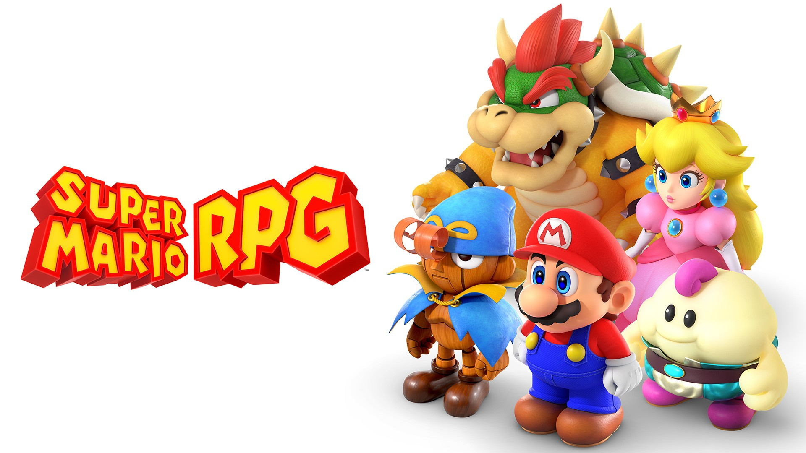
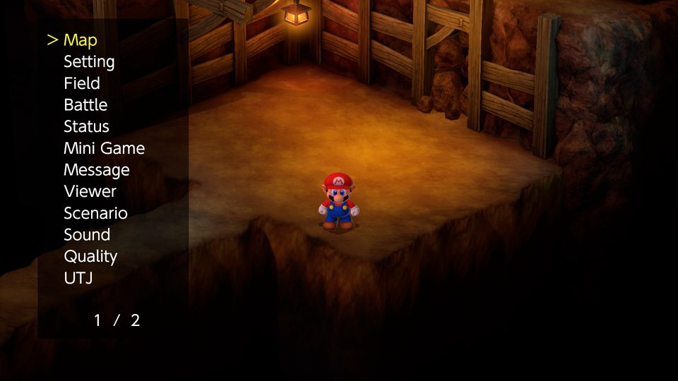
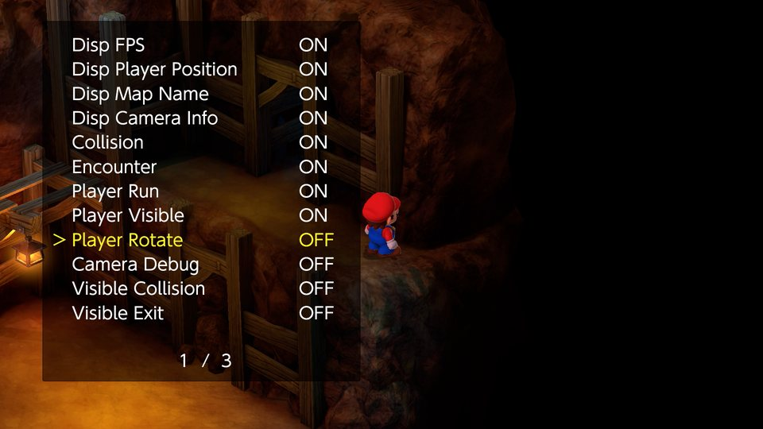
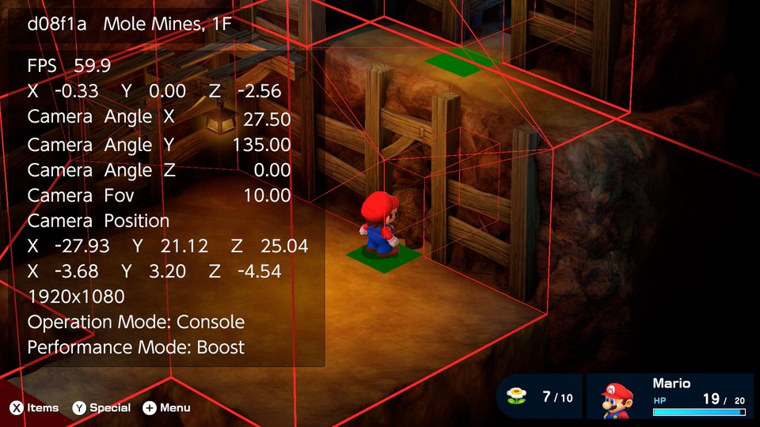

<p align="center">
  
</p>

Mario, Bowser, and Peach partner up to repair the wish-granting Star Road in this approachable role-playing adventure

<p>  </p>

**Debug Menu**
The retail build still contains the game's own debug menu, but nothing ever opens it. Tick Debug Menu Hotkey and click both sticks (L3+R3) in the field to open it. It can warp to any map, edit coins, flower points and party stats, and switch collision, encounters and an FPS and position overlay.

Both files have to be installed: the cheat file in atmosphere/contents/0100BC0018138000/cheats and the patch in atmosphere/exefs_patches/nxcheats. Copy the whole atmosphere folder to your SD card.

97F9664CFB272154.txt.noips is the full cheat file without the patch, with all the code in it, for anyone who wants to port or edit the cheats. Atmosphere does not load it.

```graphql
# Super Mario RPG™ (GLOBAL) (v65536)
./khuong/0100BC0018138000/97F9664CFB272154/*
  ├─ Party/*
  │  ├─ Inf. HP
  │  ├─ Inf. MP (Flower Power)
  │  ├─ Inf. Item Usage
  │  ├─ Star Power/*
  │  │  ├─ Star Power (Invincible)
  │  │  ├─ Star Power Hotkey (Minus Toggles)
  │  │  └─ Star Power Hotkey (Minus Gives a 10 s Star)
  │  └─ Party Starts Battles/*
  │     ├─ Party Starts Battles With Attack Up and Defense Up
  │     ├─ Party Starts Battles Behind a Barrier (99)
  │     └─ Party Starts Battles With Both Buffs and a Barrier
  ├─ Battle/*
  │  ├─ 100% Hit Chance
  │  ├─ Always Succeed At Running Away
  │  ├─ Always Special Enem(y-ies)
  │  ├─ Action Guage Always Full
  │  ├─ 999 Chain (After Successful Chain)
  │  ├─ Always Perfect Super & Ultra Jumps (Hold ZR to Stop Jumping)
  │  ├─ Auto Action Commands/*
  │  │  ├─ Auto Action Commands (Atk Only)
  │  │  └─ Auto Action Commands (Both Atk and Def)
  │  ├─ Enemies/*
  │  │  ├─ Enemies Are 0% to 50% Stronger (Per Enemy)
  │  │  ├─ Enemies Are 50% to 100% Stronger (Per Enemy)
  │  │  ├─ Enemies Are 100% to 200% Stronger (Per Enemy)
  │  │  ├─ Enemies Are 50% Weaker
  │  │  ├─ Enemies Are 75% Weaker
  │  │  └─ Enemies Have 1 HP
  │  ├─ Player Dmg Multiplier/*
  │  │  ├─ Player Dmg Multiplier (0.5x)
  │  │  ├─ Player Dmg Multiplier (1x)
  │  │  ├─ Player Dmg Multiplier (1.5x)
  │  │  ├─ Player Dmg Multiplier (2.0x)
  │  │  ├─ Player Dmg Multiplier (3.0x)
  │  │  ├─ Player Dmg Multiplier (4.0x)
  │  │  └─ Player Dmg Multiplier (5.0x)
  │  └─ Enemy Dmg Multiplier/*
  │     ├─ Enemy Dmg Multiplier (0x)
  │     ├─ Enemy Dmg Multiplier (0.5x)
  │     ├─ Enemy Dmg Multiplier (1x)
  │     ├─ Enemy Dmg Multiplier (2.0x)
  │     ├─ Enemy Dmg Multiplier (3.0x)
  │     ├─ Enemy Dmg Multiplier (4.0x)
  │     ├─ Enemy Dmg Multiplier (5.0x)
  │     └─ Enemy Dmg Multiplier (10.0x)
  ├─ Rewards/*
  │  ├─ Bonus Flower Always Drops
  │  ├─ Force Item Drop (EDIT THIS - Must use with 100% Drop Rate)
  │  ├─ 100% Item Drop Rate/*
  │  │  ├─ 100% Item Drop Rate (Normal Drop Only)
  │  │  └─ 100% Item Drop Rate (Prefer Rare Item Drop)
  │  ├─ XP Multiplier/*
  │  │  ├─ XP Multiplier (2x)
  │  │  ├─ XP Multiplier (4x)
  │  │  ├─ XP Multiplier (8x)
  │  │  └─ XP Multiplier (16x)
  │  ├─ Coin Multiplier/*
  │  │  ├─ Coin Multiplier (2x)
  │  │  ├─ Coin Multiplier (4x)
  │  │  ├─ Coin Multiplier (8x)
  │  │  └─ Coin Multiplier (16x)
  │  └─ Frog Coin Multiplier/*
  │     ├─ Frog Coin Multiplier (2x)
  │     ├─ Frog Coin Multiplier (4x)
  │     ├─ Frog Coin Multiplier (8x)
  │     └─ Frog Coin Multiplier (16x)
  ├─ Shops and Items/*
  │  ├─ All Items Cost 0 Coins
  │  ├─ Free Purchases (Coins & Frog Coins)
  │  ├─ Add 1 of Every Single Item (After Buying Anything)
  │  ├─ All Consumable Items (Check Storage Box)
  │  └─ Have (5) of All Shared Gear (Use Any Item After)
  ├─ Field/*
  │  ├─ Ignore Encounter Trigger
  │  ├─ Game Speed/*
  │  │  ├─ Game Speed (1x)
  │  │  ├─ Game Speed (1.5x)
  │  │  ├─ Game Speed (2x)
  │  │  ├─ Game Speed (3x)
  │  │  ├─ Game Speed (4x)
  │  │  └─ Game Speed (Hold R3 for 3x)
  │  ├─ Movement Speed Multiplier/*
  │  │  ├─ Movement Speed Multiplier (1.5x)
  │  │  ├─ Movement Speed Multiplier (1.75x)
  │  │  ├─ Movement Speed Multiplier (2x)
  │  │  └─ Movement Speed Multiplier (3x)
  │  └─ Jump Height Multiplier/*
  │     ├─ Jump Height Multiplier (1.5x)
  │     ├─ Jump Height Multiplier (2x)
  │     └─ Jump Height Multiplier (3x)
  ├─ Mini Games/*
  │  ├─ 2x Reward for Egg Shuffle Game
  │  ├─ Midas River - No Fish Hit(s)
  │  ├─ Auto Yoshi Race
  │  └─ Goomba Thumping High Score
  └─ Debug/*
     └─ Debug Menu/*
        ├─ Debug Menu (Attach It)
        └─ Debug Menu Hotkey (L3+R3 Opens It)
```

## Changelog
[View here](./CHANGELOG.md)

## Support

Everything here is free and stays free. If you want to leave a tip anyway:
[ko-fi.com/bad1dea](https://ko-fi.com/bad1dea).
