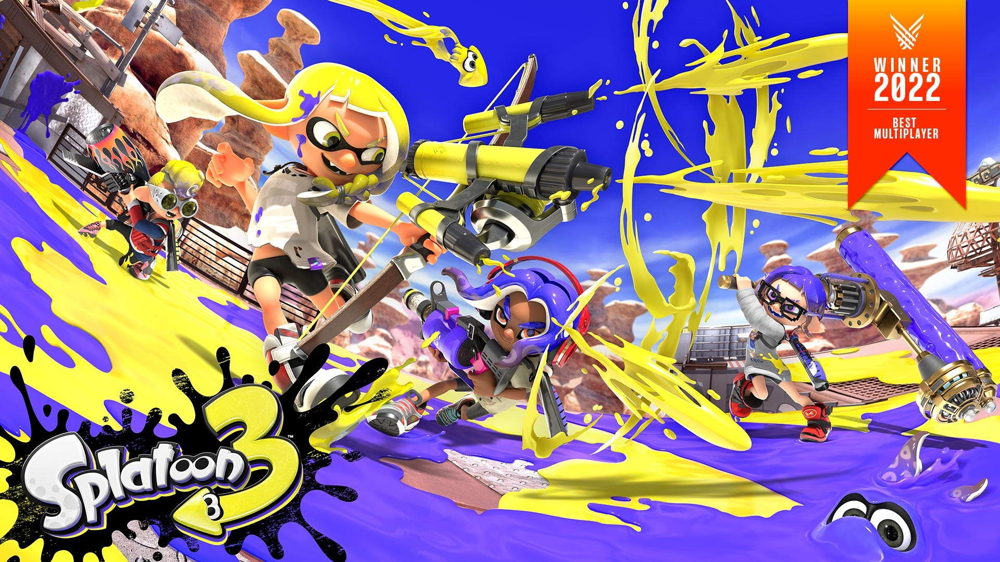

<p align="center">
  
</p>

**This set keeps the game offline.** Every cheat is meant for single
player. Don't be lame and ruin other people's fun.

```graphql
# Splatoon™ 3 (GLOBAL) (v2752512)
./khuong/0100C2500FC20000/28C4287AEE36F749/*
  ├─ Power Eggs top up as you collect
  ├─ Sardinium 99
  ├─ Upgrade Points 999
  ├─ Upgrade Points never decrease
  ├─ No game over when chances run out
  ├─ Infinite specials in Salmon Run
  ├─ Infinite Triple Inkstrike
  ├─ Infinite Fizzbangs
  ├─ One shot kill (salmonids only)
  ├─ Fast respawn
  ├─ No death zones
  ├─ Increase paint scale
  ├─ ESP
  ├─ 60 FPS
  ├─ Allow saving offline
  ├─ Offline lobby and Grizzco
  ├─ Plaza Splatfest and Big Run
  ├─ Show Big Run stages
  ├─ Always LAN
  ├─ Quick LAN
  ├─ View replays from other versions
  ├─ View replays recorded by other players
  ├─ Keep replays from older versions
  ├─ Save edit: Level 21
  ├─ Save edit: Money 9,961,472
  ├─ Save edit: Super Sea Snails 300
  ├─ Save edit: Sheldon licences 300
  └─ Save edit: Season 9 (unlocks stages)
```

## Changelog
[View here](./CHANGELOG.md)

## Support

Everything here is free and stays free. If you want to leave a tip anyway:
[ko-fi.com/bad1dea](https://ko-fi.com/bad1dea).
