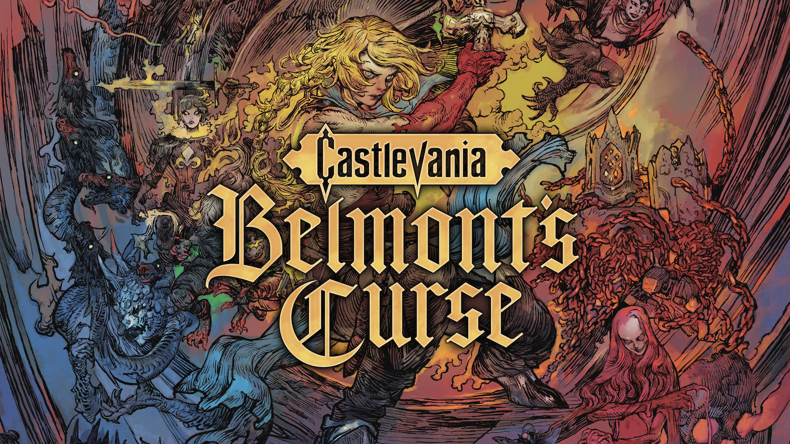

<p align="center">
  
</p>

1499. Paris is engulfed in flames as monstrous creatures suddenly emerge from the shadows. Trevor Belmont, the hero who defeated Dracula, ventures into the burning streets with his daughter, Rose Belmont.

This set is for the demo (1.0.0). Restart the game after installing it. Debug Build Flag is experimental: turn it on, then reload a level.

```graphql
# Castlevania Belmont's Curse Demo (GLOBAL) (v0)
./khuong/0100D1D027E96000/07C3F500203A719B/*
  ├─ Infinite Mana
  ├─ Infinite Health Potions
  ├─ No Cooldowns
  ├─ God Mode
  ├─ Ignore Hits
  ├─ No Fall Damage
  ├─ Movement Speed (x2)
  ├─ Infinite Air Jumps
  ├─ Infinite Air Dashes
  ├─ Game Speed/*
  │  ├─ Game Speed (x2)
  │  ├─ Game Speed (x1.5)
  │  └─ Game Speed (x0.5)
  ├─ Unlock All Abilities
  ├─ Unlock All Maps
  ├─ Reveal Fog of War
  ├─ Unlock All Fast Travel
  ├─ Skip Cutscenes
  ├─ Skip Videos
  ├─ Enemies Ignore Player
  └─ Debug Build Flag (Experimental)
```

## Changelog
[View here](./CHANGELOG.md)

## Support

Everything here is free and stays free. If you want to leave a tip anyway:
[ko-fi.com/bad1dea](https://ko-fi.com/bad1dea).
