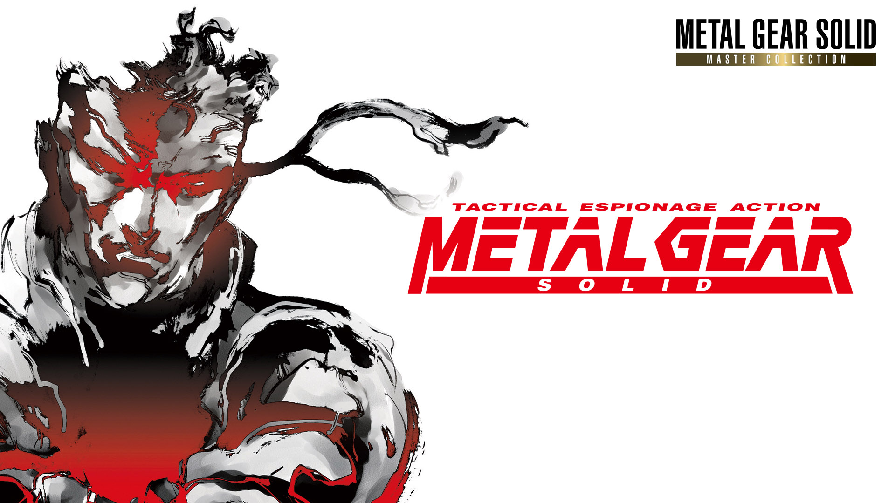

<p align="center">
  
</p>

```graphql
# METAL GEAR SOLID - Master Collection Version (GB) (v262144)
./khuong/0100C1301A9C2000/C50814B9C2BBBB29/*
  ├─ 16:9 Stretch
  ├─ Unl. Health
  ├─ Unl. Oxygen
  ├─ Crawl, Run & Snow Steps Are Silent
  ├─ No Reload
  ├─ Radar Not Jammed When Spotted
  ├─ Ghost Mode
  ├─ First Person Mode (Press Triangle)
  ├─ Have SOCOM Pistol
  ├─ Have FAMAS Rifle
  ├─ Have Grenades
  ├─ Have Nikita
  ├─ Have Stinger
  ├─ Have Claymore Mines
  ├─ Have C4
  ├─ Have Stun Grenades
  ├─ Have Chaff Grenades
  ├─ Have PSG1 Rifle
  ├─ Have Cigarettes
  ├─ Have Scope
  ├─ Have Cardboard Box A
  ├─ Have Cardboard Box B
  ├─ Have Cardboard Box C
  ├─ Have Night Vision Goggles
  ├─ Have Thermal Goggles
  ├─ Have Gas Mask
  ├─ Have Body Armor
  ├─ Have Ketchup
  ├─ Have Stealth Camouflage
  ├─ Have Bandana
  ├─ Have Camera
  ├─ Have Rations
  ├─ Have Medicine
  ├─ Have Diazepam
  ├─ Have PAL Key
  ├─ Have Lv. 100 Key Card
  ├─ Have Never Have Time Bomb
  ├─ Have Mine Detector
  ├─ Have MO Disc
  ├─ Have Rope
  ├─ Have Hankerchief
  ├─ Have Suppressor Active
  │  ** Thanks to GamerJin for the help with this one. ** 
  └─ khuong (ツ)
```