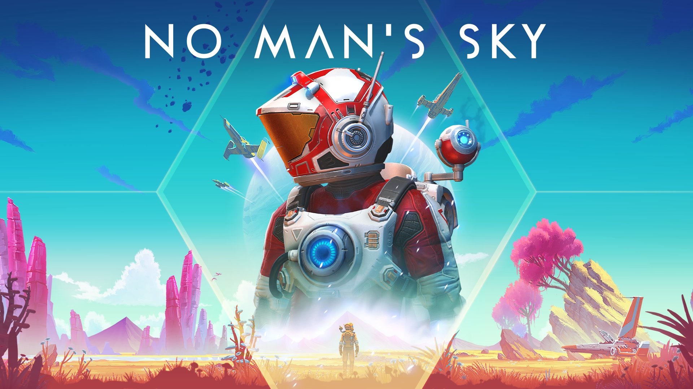

<p align="center">
  
</p>

```graphql
# No Man's Sky (US) (v1835008)
./khuong/0100853015E86000/DC7FB7F73A2B5F0F/*
  ├─ OHK
  ├─ Tons of Units, Nanites, Quicksilver
  ├─ Inf. Shields
  ├─ Inf. Health Cores
  ├─ Inf. Jetpack
  ├─ Inf. Hazard Protection
  ├─ Inf. Life Support
  ├─ Inf. Stamina
  ├─ Inf. Ship Shields
  ├─ Inf. Ship Life
  ├─ No Ship Weapon Overheat
  ├─ Instant Analysis Scan
  ├─ Instant Scanner Recharge
  ├─ No Tool Overheat
  ├─ Inf. Items (Max All Stacks + Recharge All Equipment)
  ├─ Crafting Does Not Consume Items
  ├─ Money Multiplier (2x)
  ├─ Money Multiplier (4x)
  ├─ Money Multiplier (8x)
  ├─ Item Multiplier (2x)
  ├─ Item Multiplier (4x)
  ├─ Item Multiplier (8x)
  ├─ Faster Walk/Sprint Speed
  ├─ Normal Walk/Sprint Speed
  ├─ Faster Jetpack Movement Speed
  ├─ Fast and Furious Jetpack
  ├─ Normal Jetpack
  └─ khuong (ツ)
```